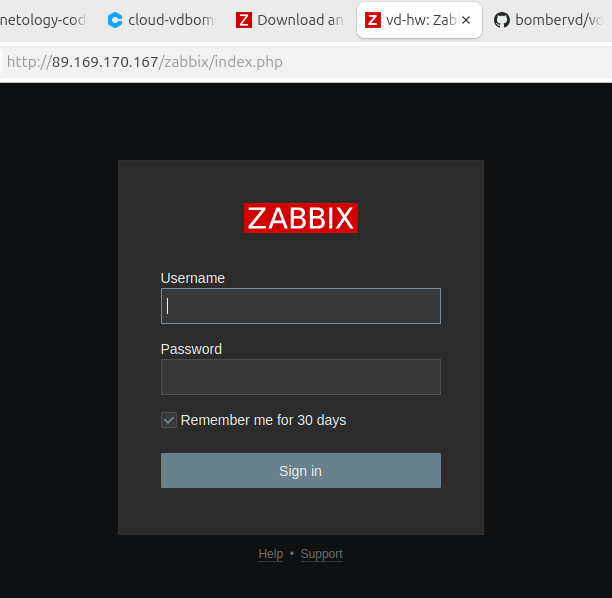
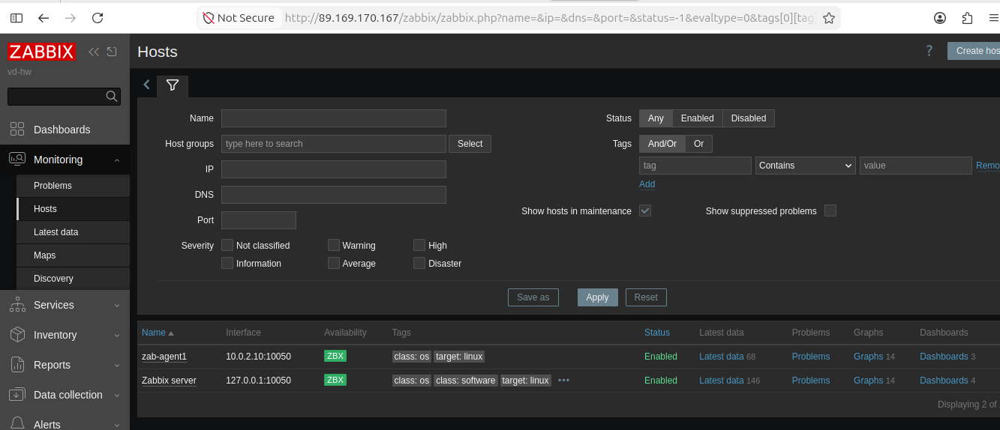
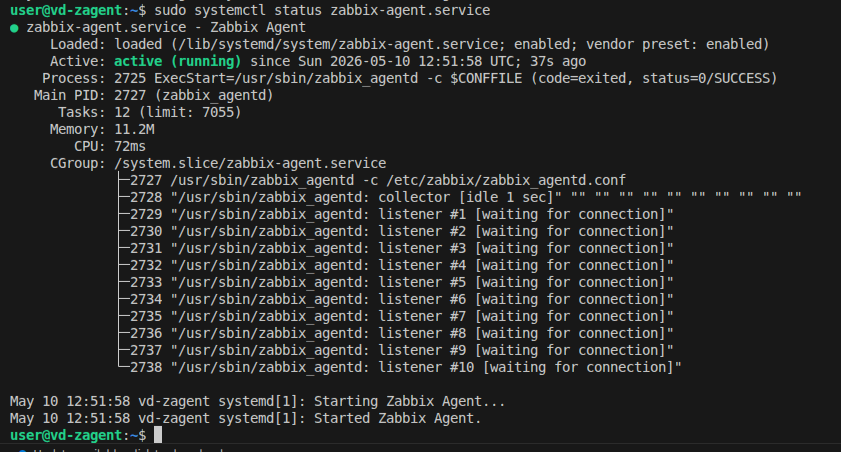
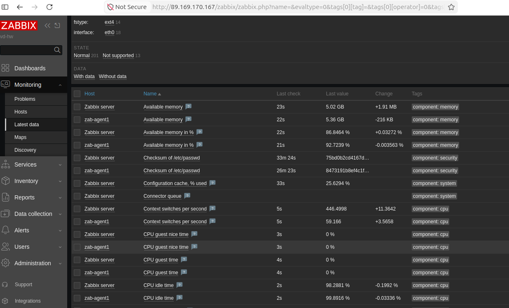

# Домашнее задание к занятию «Система мониторинга Zabbix» - Дорохов В.А.

# Задание 1

Установите Zabbix Server с веб-интерфейсом.
Процесс выполнения

    Выполняя ДЗ, сверяйтесь с процессом отражённым в записи лекции.
    Установите PostgreSQL. Для установки достаточна та версия, что есть в системном репозитороии Debian 11.
    Пользуясь конфигуратором команд с официального сайта, составьте набор команд для установки последней версии Zabbix с поддержкой PostgreSQL и Apache.
    Выполните все необходимые команды для установки Zabbix Server и Zabbix Web Server.

Требования к результатам

    Прикрепите в файл README.md скриншот авторизации в админке.
    Приложите в файл README.md текст использованных команд в GitHub.

**Ответ:**

Команды:

sudo -s
wget https://repo.zabbix.com/zabbix/7.0/ubuntu/pool/main/z/zabbix-release/zabbix-release_latest_7.0+ubuntu22.04_all.deb
dpkg -i zabbix-release_latest_7.0+ubuntu22.04_all.deb
apt update
apt install zabbix-server-pgsql zabbix-frontend-php php8.1-pgsql zabbix-apache-conf zabbix-sql-scripts zabbix-agent
apt install postgresql
sudo -u postgres createuser --pwprompt zabbix
sudo -u postgres createdb -O zabbix zabbix
zcat /usr/share/zabbix-sql-scripts/postgresql/server.sql.gz | sudo -u zabbix psql zabbix
nano /etc/zabbix/zabbix_server.conf
systemctl restart zabbix-server zabbix-agent apache2
systemctl enable zabbix-server zabbix-agent apache2

# Задание 2

Установите Zabbix Agent на два хоста.
Процесс выполнения

    Выполняя ДЗ, сверяйтесь с процессом отражённым в записи лекции.
    Установите Zabbix Agent на 2 вирт.машины, одной из них может быть ваш Zabbix Server.
    Добавьте Zabbix Server в список разрешенных серверов ваших Zabbix Agentов.
    Добавьте Zabbix Agentов в раздел Configuration > Hosts вашего Zabbix Servera.
    Проверьте, что в разделе Latest Data начали появляться данные с добавленных агентов.

Требования к результатам

    Приложите в файл README.md скриншот раздела Configuration > Hosts, где видно, что агенты подключены к серверу
    Приложите в файл README.md скриншот лога zabbix agent, где видно, что он работает с сервером
    Приложите в файл README.md скриншот раздела Monitoring > Latest data для обоих хостов, где видны поступающие от агентов данные.
    Приложите в файл README.md текст использованных команд в GitHub

**Ответ:**

Задание 3 со звёздочкой*

Установите Zabbix Agent на Windows (компьютер) и подключите его к серверу Zabbix.
Требования к результатам

    Приложите в файл README.md скриншот раздела Latest Data, где видно свободное место на диске C:

Критерии оценки

    Выполнено минимум 2 обязательных задания
    Прикреплены требуемые скриншоты и тексты
    Задание оформлено в шаблоне с решением и опубликовано на GitHub
